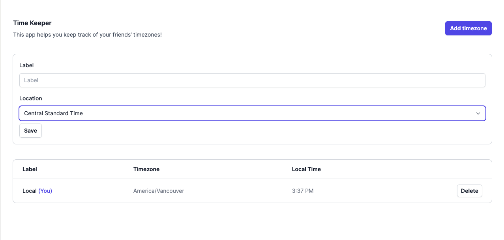

This is a [Next.js](https://nextjs.org/) project bootstrapped with [`create-next-app`](https://github.com/vercel/next.js/tree/canary/packages/create-next-app).

---

## Purpose

This project was an interview assignment to showcase ability of writing e2e tests with Playwright. The application-under-test (AUT) is a web-based single-page-application (SPA) comprising a table containing entries of timezones, as well as the simple ability to create new entries.

See sample screenshot of app here:

## Getting Started

1. Ensure NodeJS and `npm` are installed. See [here](https://docs.npmjs.com/downloading-and-installing-node-js-and-npm#using-a-node-installer-to-install-nodejs-and-npm) for downloads
   - The version of NodeJS used here was `20.8.0`
   - … and the version of `npm` was `10.1.0`
1. Clone the repo
1. Enter the `timezone-app/` directory
1. Run `npm install`
1. Ensure no other server is active on http://localhost:3000
1. Run the development server with `npm run dev`
1. Open [http://localhost:3000](http://localhost:3000) with your browser to see the app

This project uses [`next/font`](https://nextjs.org/docs/basic-features/font-optimization) to automatically optimize and load Inter, a custom Google Font.

---

### Launch the automated e2e tests with [Playwright](https://playwright.dev)

- `npm run e2e` for headless
- `npm run e2e-headed` for headed
- See Playwright's documentation on running tests [here](https://playwright.dev/docs/running-tests)

---

## Notes on testing

### Automated

**Tool used to write the automated browser and UI-based e2e (end-to-end) tests**

- [Playwright](https://playwright.dev/) `v1.37.1`

**Models, design patterns etc. used**

- Page object model (POM) has been used in writing test(s).
  - See Playwright's documentation [here](https://playwright.dev/docs/pom)

**Failing tests**

- Certain tests are expected to fail due to the current state of the codebase and specifications
  - Brief descriptions have been provided as code comments

**Limitations and scope**

- Since automated e2e tests such as these are expensive to write and maintain, they have been written on a strictly-needed basis as per the provided specifications
  - Of course, there is room for further tests e.g. as highlighted under [Issues](https://github.com/Noffica/Playwright-tests-on-a-SPA/issues)
  - Only straightforward paths have been tested (under the present scope)
- Related to the previous point, hard-coded string inputs have been used to test the only text input field
  - Generation of random text strings has been disregarded for the following reason(s):
    - Inputs in tests should be controlled and known explicitly (otherwise test inputs become a new, uncontrolled variable into the system)
  - See the following [request for clarification](https://github.com/Noffica/Playwright-tests-on-a-SPA/issues/10) of the specifications
- Tests do **not** feature page refreshes/reloads as part of verification of functionality or _persistance_ of data. This could be TODO work for the future.
- _Visual testing_ (layout, formatting etc.) has **not** been performed in any form. This could be TODO work for the future
- The current configuration does **not** utilise any screenshots or screen recordings (upon failure). This could be TODO work for the future
